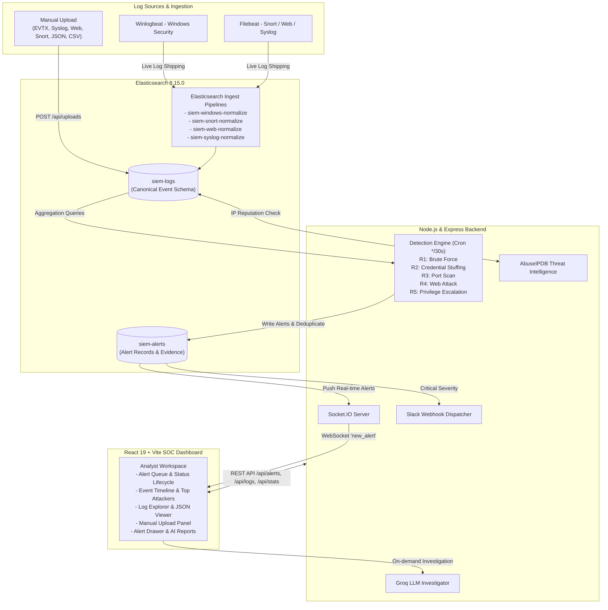

# CyberEye — Custom SIEM Dashboard

CyberEye is a full-featured, lightweight Security Information and Event Management (SIEM) platform designed for real-time threat monitoring, log normalization, aggregation-based rule correlation, and automated security alert dispatching. Built without external heavyweight dependencies like Kibana, CyberEye couples an Elasticsearch data layer and Node.js correlation engine directly to a custom, responsive React SOC dashboard powered by live WebSockets.

---

## Overview

Modern security monitoring requires scalable ingestion, deterministic correlation, and actionable analyst workflows. CyberEye provides an end-to-end detection pipeline that ingests system logs, normalizes them into a canonical schema, evaluates rolling aggregation queries across defined correlation windows, maps detected threats to the MITRE ATT&CK framework, and pushes real-time alerts to a cyber defense console. It supports live log streaming via Beats (Filebeat/Winlogbeat) as well as direct multi-format manual log uploads (EVTX, Syslog, Apache/Nginx, Snort, JSON, CSV).

---

## Key Features

- **Real-Time SOC Dashboard**: Responsive single-page interface with live metric cards, event timelines, and threat visualizers.
- **Centralized Log Ingestion**: Accepts events from Filebeat, Winlogbeat, or browser-based manual log uploads.
- **Elasticsearch Ingest Pipelines**: Server-side normalization of diverse formats into a unified canonical schema (`siem-logs`).
- **Stateless Correlation Engine**: Node.js `node-cron` engine running scheduled Elasticsearch aggregations (`terms`, `cardinality`, `date_histogram`) every 30 seconds with zero in-memory state loss across restarts.
- **R1–R5 Detection Rules**: Five correlation rules detecting Brute Force, Credential Stuffing, Port Scanning, Web Attacks (SQLi/XSS), and Privilege Escalation.
- **MITRE ATT&CK Mapping**: Every generated alert is automatically tagged with MITRE ATT&CK technique IDs, tactic categories, and descriptive labels.
- **Real-Time WebSocket Alerts**: Instant notification delivery via Socket.IO directly to connected security analysts without polling.
- **Interactive Log Explorer**: Fast search and filtering across raw and normalized logs with JSON payload inspection.
- **Event Timeline & Top Attackers**: Visual histograms of incoming log volumes and aggregations of high-frequency attacker IPs.
- **Manual Log Uploader**: Direct web upload and ingestion of Windows EVTX, Linux auth/syslog, Apache/Nginx access logs, Snort alerts, JSON/NDJSON, and CSV files.
- **AI-Powered Threat Investigation**: On-demand structured incident reports generated via a Groq-compatible LLM (`openai/gpt-oss-20b`).
- **Threat Intelligence Enrichment**: Modular IP reputation lookups using the AbuseIPDB API to score external threat actors.
- **Critical Alert Notifications**: Webhook integration dispatching high-priority alerts to Slack channels.

---

## Architecture

CyberEye separates ingestion, normalization, detection, and visualization into distinct decoupled layers:



---

## Detection Rules

The correlation engine executes five rules using native Elasticsearch aggregations, avoiding in-memory buffering:

| Rule | Detection | Severity | Correlation Logic | MITRE ATT&CK |
|:---:|---|:---:|---|:---:|
| **R1** | **Brute-force login** | `high` | $\ge 5$ Windows Event ID 4625 (`auth_failure`) from the same `source.ip` within a **60-second** window. | **T1110** (Brute Force) |
| **R2** | **Credential stuffing** | `critical` | A qualifying R1 brute-force burst followed by a successful Windows Event ID 4624 (`auth_success`) from the **same** `source.ip` within **5 minutes**. | **T1110** (Brute Force) |
| **R3** | **Port scan** | `high` | Same `source.ip` hitting $\ge 10$ distinct `destination.port` values in Snort alert events within a **30-second** window. | **T1046** (Network Service Discovery) |
| **R4** | **Web attack (SQLi/XSS)** | `medium` | Apache or Nginx request `http.uri` matching known SQL injection or cross-site scripting patterns within a **1-minute** window. | **T1190** (Exploit Public-Facing Application) |
| **R5** | **Privilege escalation** | `critical` | Windows Event ID 4672 (`privilege_assigned`) occurring within **5 minutes** after Event ID 4624 (`auth_success`) for the **same** `user.name`. | **T1078** (Valid Accounts) |

*Alert Deduplication: CyberEye suppresses duplicate open alerts for the same rule and entity within a 5-minute cooldown window, keying on `source.ip` first, then falling back to `affected_host` and `affected_user`.*

---

## Log Ingestion

CyberEye supports two operational ingestion mechanisms:

### 1. Live Log Shippers (Beats)
- **Winlogbeat**: Configured in `winlogbeat/winlogbeat.yml` to ship Windows Security channel Event IDs (`4624`, `4625`, `4672`, `4688`) directly to Elasticsearch via the `siem-windows-normalize` pipeline.
- **Filebeat**: Configured in `filebeat/filebeat.yml` using generic `type: log` inputs to tail:
  - Snort IDS fast-alerts (`/var/log/snort/alert`) $\rightarrow$ `siem-snort-normalize`
  - Nginx access logs (`/var/log/nginx/access.log`) $\rightarrow$ `siem-web-normalize`
  - Apache access logs (`/var/log/apache2/access.log`) $\rightarrow$ `siem-web-normalize`
  - Linux syslog and auth logs (`/var/log/syslog`, `/var/log/auth.log`) $\rightarrow$ `siem-syslog-normalize`

### 2. Manual Log Ingestion (REST API & Web UI)
Analysts can upload raw log files directly through the frontend dashboard or `POST /api/uploads`. Supported formats include:
- **Windows EVTX** (`.evtx`): Binary event log files parsed into canonical Windows schema fields.
- **Linux Syslog / Auth Logs** (`.log`, `.txt`): Plaintext syslog formats parsed for authentication failures, successes, and sudo elevations.
- **Web Access Logs** (`.log`, `.txt`): Apache and Nginx Combined/Common access logs parsed for client IP, URI, and SQLi/XSS patterns.
- **Snort IDS Alerts** (`.log`, `.txt`, `.alert`): Plaintext fast-alert entries parsed for protocol, source IP/port, and target IP/port.
- **Structured Data** (`.json`, `.ndjson`, `.csv`): Arrays, single objects, or tabular CSV records mapped to SIEM fields.

### 3. Normalization Pipelines
Elasticsearch Ingest Pipelines standardize raw inputs into the canonical SIEM schema:
- `siem-windows-normalize`: Maps event IDs to canonical event types, extracts user/computer names, and safely strips non-routable placeholder IP values (`IpAddress = "-"`).
- `siem-snort-normalize`: Extracts `source.ip`, `source.port`, `destination.ip`, and `destination.port:int`, and maps Snort priority to standard severity tiers.
- `siem-web-normalize`: Parses request URIs, executes URL decoding, and flags SQL injection / XSS signatures.
- `siem-syslog-normalize`: Extracts hostnames, client IPs, usernames, and classifies events as `auth_failure`, `auth_success`, or `privilege_assigned`.

---

## Dashboard

The user interface is an enterprise-styled, single-page React console:

- **Summary Metric Cards**: Live counters displaying 24-hour total event volume, total open alerts, and open critical alerts.
- **Alert Queue**: Real-time listing of active detections with severity badges (`Critical`, `High`, `Medium`, `Low`), MITRE technique tags, affected entities, and status toggle buttons (`Open` $\rightarrow$ `Acknowledged` $\rightarrow$ `Closed`).
- **Event Timeline**: Interactive histogram charting event volume distribution across log sources over time.
- **Top Attackers**: Bar chart and entity table aggregating the most active offending source IP addresses, clickable to filter the rest of the dashboard.
- **Log Explorer**: Tabular event viewer with real-time text query filtering, source IP filtering, and expandable JSON views of raw documents.
- **Alert Detail Drawer**: Slide-over drawer providing MITRE ATT&CK reference data, timestamp timelines, underlying raw event evidence hits, and an on-demand AI investigation trigger.
- **Upload Panel**: File drop zone supporting single or batch file uploads with automatic format detection and immediate post-ingest rule triggering.

---

## AI Investigation

CyberEye integrates an AI SOC Analyst assistant powered by a Groq-compatible LLM endpoint:

- **Model**: Configured via `GROQ_MODEL` (defaults to `openai/gpt-oss-20b`).
- **On-Demand Execution**: To conserve API quotas, investigations are triggered only when an analyst clicks **Investigate Alert** in the Alert Detail Drawer.
- **Structured Output**: The LLM analyzes the alert metadata, MITRE tactics, and underlying log evidence hits to generate a structured JSON report containing:
  - An executive incident summary.
  - A threat score with rationale.
  - Recommended incident response actions (containment, eradication, recovery).
  - MITRE ATT&CK alignment analysis.
- **Result Caching**: Completed reports are persisted back to the alert record in Elasticsearch (`siem-alerts`), preventing redundant API calls.

*Note: All API credentials are read strictly from backend environment variables and must be configured in `backend/.env`.*

---

## Threat Intelligence & Notifications

### AbuseIPDB Integration
- When an external `source.ip` is ingested, CyberEye can query the AbuseIPDB API v2 to retrieve an abuse confidence score.
- If the score exceeds the threshold ($\ge 50$), the document in `siem-logs` is enriched with `threat.score` and `threat.is_malicious: true`.
- Requires a valid `ABUSEIPDB_API_KEY` in `backend/.env`. If unconfigured, the enrichment service logs a warning and gracefully skips.

### Slack Notifications
- High-priority detections (rules with `severity: 'critical'`, such as R2 Credential Stuffing and R5 Privilege Escalation) dispatch formatted alerts to a Slack channel via an incoming webhook.
- Includes the rule name, affected host, attacker IP, and a deep-link to the incident in the CyberEye dashboard.
- Requires `SLACK_WEBHOOK_URL` in `backend/.env`. If unconfigured, notification dispatching is skipped without interrupting detection.

---

## Project Structure

```text
siem/
├── docker-compose.yml              # Docker orchestration (Elasticsearch, backend, frontend)
├── .gitignore                      # Git exclusion rules
├── README.md                       # Project documentation
├── backend/
│   ├── Dockerfile                  # Production container definition
│   ├── .dockerignore               # Container build exclusions
│   ├── .env.example                # Backend environment variable template
│   ├── package.json                # Dependencies and npm run scripts
│   ├── src/
│   │   ├── index.js                # Express & Socket.IO initialization
│   │   ├── alerts/
│   │   │   └── writer.js           # Deduplication, alert storage, and alert dispatching
│   │   ├── enrichment/
│   │   │   ├── abuseipdb.js        # IP reputation client
│   │   │   ├── poller.js           # Ingestion enrichment polling worker
│   │   │   └── slack.js            # Slack webhook notification dispatcher
│   │   ├── es/
│   │   │   ├── client.js           # Elasticsearch singleton client
│   │   │   ├── indices.js          # Index mapping definitions (siem-logs, siem-alerts)
│   │   │   ├── setup.js            # One-time bootstrap script (indices & pipelines)
│   │   │   └── seed.js             # Synthetic attack dataset generator
│   │   ├── ingest/
│   │   │   └── normalizer.js       # Ingest pipeline definitions (Windows, Snort, Web, Syslog)
│   │   ├── llm/
│   │   │   ├── groq.js             # Groq LLM API client
│   │   │   ├── investigator.js     # SOC investigation prompt & response validation
│   │   │   └── summarizer.js       # Legacy summarizer fallback
│   │   ├── routes/
│   │   │   ├── alerts.js           # /api/alerts endpoints
│   │   │   ├── logs.js             # /api/logs endpoints
│   │   │   ├── stats.js            # /api/stats endpoints
│   │   │   └── uploads.js          # /api/uploads endpoints
│   │   ├── rules/
│   │   │   ├── engine.js           # cron-based 30-second execution runner
│   │   │   ├── bruteForce.js       # R1 implementation
│   │   │   ├── credentialStuffing.js # R2 implementation
│   │   │   ├── portScan.js         # R3 implementation
│   │   │   ├── webAttack.js        # R4 implementation
│   │   │   ├── privEsc.js          # R5 implementation
│   │   │   └── mitre.js            # MITRE ATT&CK lookup dictionary
│   │   └── uploads/
│   │       └── service.js          # Multi-format manual log parsing engine
│   └── test/
│       ├── detection-rules.test.js # Correlation engine unit tests
│       └── ingest-pipelines.test.js # Pipeline parsing integration tests
├── frontend/
│   ├── Dockerfile                  # Frontend container definition
│   ├── .dockerignore               # Container build exclusions
│   ├── .env.example                # Frontend environment variable template
│   ├── package.json                # React 19 & Tailwind dependencies
│   ├── vite.config.js              # Vite dev server & proxy settings
│   ├── index.html                  # HTML entry point
│   └── src/
│       ├── App.jsx                 # Main dashboard layout
│       ├── main.jsx                # Application root
│       ├── index.css               # Tailwind styling definitions
│       ├── api/siem.js             # REST API client
│       ├── hooks/useWebSocket.js   # Socket.IO connection hook
│       ├── components/             # Dashboard modules (AlertQueue, Timeline, etc.)
│       ├── components/ai/          # AI investigation cards & widgets
│       └── components/ui/          # Reusable UI primitives
├── filebeat/
│   └── filebeat.yml                # Filebeat input & pipeline mapping configuration
└── winlogbeat/
    └── winlogbeat.yml              # Winlogbeat event filtering configuration
```

---

## Getting Started

### Prerequisites
- [Docker Desktop](https://www.docker.com/) (running with WSL 2 on Windows or native Linux Docker)
- [Node.js](https://nodejs.org/) v20+ and npm
- Git

---

### Step 1: Clone the Repository
```bash
git clone https://github.com/your-username/cybereye-siem.git
cd cybereye-siem
```

---

### Step 2: Configure Environment Variables
Copy the template to create a local `backend/.env` file:
```bash
# On Windows PowerShell:
Copy-Item backend/.env.example backend/.env

# On Linux / macOS:
cp backend/.env.example backend/.env
```
*(Optional)* Add your third-party API keys to `backend/.env` if you want AI investigation, AbuseIPDB enrichment, or Slack notifications enabled. If left with defaults, CyberEye operates normally while skipping those external features.

---

### Step 3: Start the Elasticsearch Service
Start the single-node Elasticsearch 8.15.0 container:
```bash
docker compose up -d elasticsearch
```
Verify Elasticsearch is healthy:
```bash
curl http://localhost:9200
```

---

### Step 4: Bootstrap Indices and Ingest Pipelines
Install dependencies and register the index mappings (`siem-logs`, `siem-alerts`) and the four ingest pipelines:
```bash
cd backend
npm install
npm run setup
```

---

### Step 5: Seed Demo Attack Data
Generate synthetic security events across all detection rules (Windows logon bursts, port scans, SQL injection attacks, privilege assignments):
```bash
npm run seed
```
*What this does: Ingests realistic log sequences into `siem-logs`. Within 30 seconds, the rule engine will evaluate the data and fire alerts across R1 through R5.*

---

### Step 6: Launch Backend & Frontend

Open two terminal sessions:

**Terminal 1 — Backend:**
```bash
cd backend
npm run dev
# Backend starts on http://localhost:4000
```

**Terminal 2 — Frontend:**
```bash
cd frontend
npm install
npm run dev
# Frontend starts on http://localhost:5173
```

Navigate to **`http://localhost:5173`** in your browser to access the live SOC dashboard.

---

### Service Endpoints Summary

| Service | Port | Endpoint | Description |
|---|:---:|---|---|
| **Frontend UI** | `5173` | `http://localhost:5173` | React SOC Analyst Dashboard |
| **Backend API** | `4000` | `http://localhost:4000` | Express REST API & Socket.IO server |
| **Backend Health** | `4000` | `http://localhost:4000/api/health` | Service health & Elasticsearch ping |
| **Elasticsearch** | `9200` | `http://localhost:9200` | Elasticsearch REST cluster endpoint |

---

## Testing

CyberEye includes a suite of automated unit and integration tests using Node.js built-in test runner (`node:test`):

```bash
cd backend
npm test
```

### Verified Test Results
```text
✔ R1 fires for five canonical auth_failure events from one Windows source IP in 60 seconds
✔ R1 does not receive a candidate for four failures
✔ R2 fires only when canonical auth_success follows the burst from the same IP within five minutes
✔ R2 rejects a successful authentication from a different IP
✔ R2 rejects an authentication after the five-minute correlation window
✔ R2 can correlate a qualifying historical 60-second burst to a success near the end of five minutes
✔ R5 fires when auth_success precedes privilege_assigned for the same user within five minutes
✔ R5 rejects a login after privilege assignment and a login for another user
✔ R3 fires at ten distinct ports and does not fire at nine
✔ R4 produces a candidate for a matching normalized web attack bucket
✔ deduplication uses source IP first and host/user only when the IP is absent
✔ siem-snort-normalize parses raw fast-alert messages into canonical network fields
✔ siem-web-normalize parses raw access logs and detects SQLi / XSS attacks
✔ siem-syslog-normalize parses raw syslog and auth logs into canonical host, auth, and privilege fields
✔ siem-windows-normalize preserves Windows Event ID mapping
✔ siem-windows-normalize handles valid IP and ignores "-" IpAddress

16 tests passed, 0 failed
```

---

## Environment Variables

All sensitive values are configured via environment files. **Never commit `.env` files to source control.**

| Variable | File | Default / Sample | Description |
|---|---|---|---|
| `ELASTICSEARCH_URL` | `backend/.env` | `http://localhost:9200` | Connection URL for the Elasticsearch instance |
| `ES_LOGS_INDEX` | `backend/.env` | `siem-logs` | Target index for normalized events |
| `ES_ALERTS_INDEX` | `backend/.env` | `siem-alerts` | Target index for detected rule alerts |
| `PORT` | `backend/.env` | `4000` | HTTP port for the backend server |
| `FRONTEND_ORIGIN` | `backend/.env` | `http://localhost:5173` | Allowed CORS origin for frontend REST & WebSocket |
| `MAX_UPLOAD_SIZE_MB` | `backend/.env` | `10` | Maximum file size for manual log uploads (in MB) |
| `RULE_ENGINE_CRON` | `backend/.env` | `*/30 * * * * *` | Cron schedule expression for rule engine execution |
| `LLM_PROVIDER` | `backend/.env` | `groq` | Active LLM integration driver (`groq`) |
| `GROQ_API_KEY` | `backend/.env` | `your_groq_api_key` | API authentication key for Groq Cloud |
| `GROQ_MODEL` | `backend/.env` | `openai/gpt-oss-20b` | Target LLM model identifier |
| `ABUSEIPDB_API_KEY` | `backend/.env` | `API required here` | API key for AbuseIPDB IP reputation checks |
| `SLACK_WEBHOOK_URL` | `backend/.env` | `API required here` | Incoming Webhook URL for critical Slack notifications |
| `DASHBOARD_BASE_URL` | `backend/.env` | `http://localhost:5173` | Base URL used to construct incident deep-links |
| `BACKEND_URL` | `frontend/.env` | `http://localhost:4000` | Target backend URL used by the Vite proxy |

---

## Windows & Linux Lab Deployment

CyberEye is structured to ingest telemetry from distributed endpoints and virtual machines:

### Lab Network Architecture
For a safe, contained attack simulation lab:
- **Host-Only Network**: Configure VMs on an isolated virtual network (e.g., VirtualBox Host-Only subnet `192.168.56.0/24`). The SIEM host machine sits at `192.168.56.1`.
- **Shipper Configuration**: On the endpoint VMs, configure `filebeat.yml` and `winlogbeat.yml` with the host's Host-Only IP instead of `localhost`:
  ```yaml
  output.elasticsearch:
    hosts: ['192.168.56.1:9200']
  ```
- **Windows Firewall**: An inbound firewall rule must be configured on the SIEM host to permit incoming TCP port `9200` packets originating exclusively from `192.168.56.0/24`.
- **Windows Audit Policy**: To capture Event ID 4625 for R1/R2 testing, the target Windows machine must have audit failure logging explicitly enabled:
  ```powershell
  auditpol /set /subcategory:"Logon" /success:enable /failure:enable
  auditpol /set /subcategory:"Special Logon" /success:enable
  ```

> [!IMPORTANT]
> **Endpoint Validation Status**:
> Windows endpoint integration is prepared, but full end-to-end Winlogbeat validation requires a Windows VM and is currently pending. Linux live ingestion via Filebeat (Snort, Apache/Nginx, Syslog) has been validated.

---

## Security Notes

- **Never Commit Secrets**: Ensure `backend/.env` and `frontend/.env` are never tracked by Git. Always use `.env.example` templates for configuration sharing.
- **Development Configuration Notice**: The current Docker setup runs Elasticsearch with `xpack.security.enabled=false` and single-node discovery without TLS. This is intended strictly for local development, academic review, and isolated lab environments.
- **Production Hardening**: Any real-world deployment requires enabling Elasticsearch authentication (RBAC / API keys), configuring mutual TLS (HTTPS), and restricting port 9200 exposure behind a reverse proxy or firewall.

---

## Limitations

- **Windows VM Live Ingestion**: Windows Winlogbeat integration has been verified through pipeline simulation and schema tests, but live multi-day telemetry from a physical/virtual Windows machine remains pending hardware/VM availability.
- **Single-Node Elasticsearch**: Current architecture relies on a single-node Elasticsearch cluster without replication or index lifecycle management (ILM).
- **Third-Party API Requirements**: AI incident investigations, AbuseIPDB scoring, and Slack alerts require valid external API credentials.
- **Educational / Portfolio Scope**: CyberEye is an engineering demonstration of SIEM architecture rather than a commercially certified, compliance-hardened enterprise SOC platform.

---

## Future Enhancements

- Complete live end-to-end Windows VM validation with active Winlogbeat streaming.
- Broader detection rule coverage across additional MITRE ATT&CK tactics (e.g., Persistence, Lateral Movement, Exfiltration).
- Support for Sigma rule importing and translation to Elasticsearch aggregations.
- Role-Based Access Control (RBAC) and user authentication for the React dashboard.
- Elasticsearch security hardening with TLS certificates and API key authentication.
- Automated CI/CD testing pipeline using GitHub Actions to run the test suite on pull requests.

---

## Screenshots

*(Screenshots can be placed in `docs/screenshots/`)*

| Dashboard Overview | Real-Time Alert Queue |
|:---:|:---:|
| `docs/screenshots/dashboard.png` | `docs/screenshots/alerts.png` |

| Log Explorer & JSON Inspector | AI Incident Investigation Drawer |
|:---:|:---:|
| `docs/screenshots/log-explorer.png` | `docs/screenshots/ai-investigation.png` |

---

## License

This project is open-source and available under the [MIT License](LICENSE).

---

## Project Status

**Current status**: Functional local SIEM demonstration with automated detection tests and Docker-based deployment. Windows endpoint validation remains pending until a Windows VM is available.
